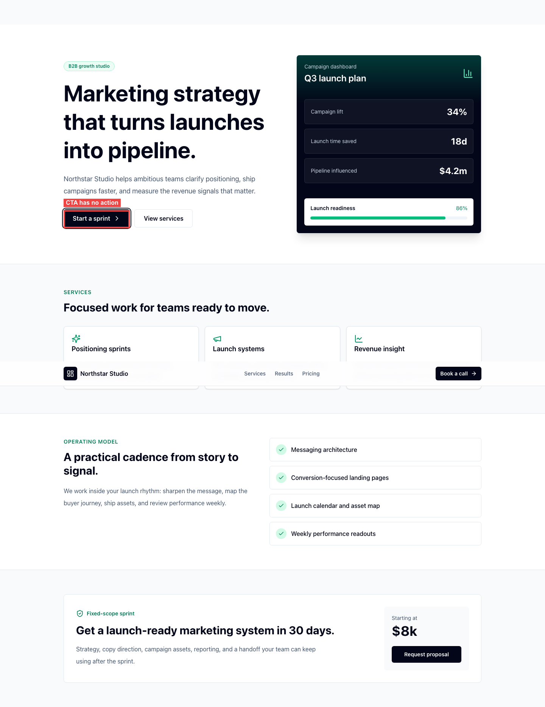

# Accessibility Audit Report

## Summary

- URL: `http://127.0.0.1:5173/`
- URL slug: `127.0.0.1:5173`
- Date/time: `2026-06-22 20:54` Europe/Copenhagen
- Auditor: Codex
- Branch: `main`
- Report folder: `a11y-reports/main/127.0.0.1:5173/20260622-205401/`
- Plans folder: `plans/`
- Browser/tooling: Chromium via Playwright, axe-core
- Dependency status: Playwright and axe-core available in the project; browser audit run outside the sandbox to reach the local dev server
- Axe pre-scan: completed; axe-covered issues excluded from this report
- Viewports: Desktop `1440x900`, mobile `390x844`
- Screen reader: not tested

## Scope

- Pages or flows tested: single-page marketing site, header navigation, hero CTAs, service/results/pricing sections, pricing CTA.
- Interactions tested: Tab and Shift-independent forward keyboard traversal, Enter activation for CTA buttons, pointer hover/click on hero CTAs, desktop section links, mobile reflow.
- Keyboard-only navigation path tested: page logo, desktop section links, `Book a call`, `Start a sprint`, `View services`, `Request proposal`, then wrap back to the top.
- Axe deduplication notes: axe reported zero violations on desktop and mobile, so the finding below is not an axe duplicate.
- Areas not tested: screen reader output, real booking/proposal integrations, analytics, and any off-page flows because no such destinations or dialogs were exposed.
- Constraints or assumptions: the local Vite server was already running outside the sandbox; no destructive actions were present.

## Findings Overview

| Severity | Count |
| --- | ---: |
| Blocker | 0 |
| High | 1 |
| Medium | 0 |
| Low | 0 |
| Observation | 0 |

## Findings

### A11Y-001 [High] Primary CTA buttons are focusable but perform no action

- Plan: [plans/A11Y-001.md](plans/A11Y-001.md)
- Location: Header `Book a call`, hero `Start a sprint`, hero `View services`, pricing `Request proposal`
- Code location(s): `src/App.tsx` lines 69, 88, 92, and 198
- Why axe did not cover this: axe can detect many structural name, role, and state issues, but it does not know the intended result of a CTA activation. These buttons have accessible names and are keyboard-focusable, so the failure only appears during manual activation testing.
- Annotated screenshot:

- Steps to reproduce:
  1. Open `http://127.0.0.1:5173/`.
  2. Use Tab to focus `Book a call`, `Start a sprint`, `View services`, or `Request proposal`.
  3. Press Enter or click the focused control.
- Expected: each CTA should either navigate to its target, open an accessible dialog, submit a form, or otherwise expose a clear result matching the visible label.
- Actual: activation leaves the URL unchanged, does not open a dialog, does not move to a meaningful target, and does not provide status feedback. Pointer clicks produce the same result.
- Impact: keyboard and assistive-technology users can discover and activate apparent core actions but receive no result or explanation, making the booking/proposal task appear broken. Sighted pointer users are also affected, but keyboard users have less context to distinguish an intentionally disabled placeholder from a failed activation.
- Suggested fix: replace navigation-style CTAs with links when they navigate, add `onClick` behavior when they open a dialog or route, or remove/disable placeholder controls until an action exists. If a control intentionally opens a dialog, expose the dialog with correct focus management and accessible naming.
- Notes: `View services` appears to be intended as section navigation and should likely be an anchor to `#services`; booking/proposal CTAs need a real route, form, mail link, or accessible modal flow.

## Keyboard And Focus Notes

- Keyboard-only path completed: yes, across desktop and mobile.
- Focus order: logical on desktop and mobile. Desktop includes logo, section links, header CTA, hero CTAs, pricing CTA, then wraps. Mobile removes the desktop section links from the focus order because the section nav is hidden at that breakpoint.
- Focus visibility: visible on links and buttons. Buttons use a clear ring; links use the browser default outline.
- Keyboard activation: section links can be reached on desktop; CTA buttons can be focused and activated but do not perform meaningful actions.
- Escape/close behavior: no dialogs, menus, or overlays were present to close.
- Focus trapping and restoration: no modal or trapped-focus pattern was present.

## Pointer And Hover Notes

- Hover states: CTA buttons expose visible hover states.
- Target size risks: tested CTAs are large enough on desktop and mobile. Header section links are smaller but only present on desktop.
- Tooltip/menu behavior: no tooltips or menus were present.
- Pointer-only interactions: none identified.

## Forms And Errors

- Labels and descriptions: no form controls were present.
- Required fields: not applicable.
- Validation: not applicable.
- Error announcements or associations: not applicable.
- Focus movement: not applicable.

## Responsive Notes

- Mobile navigation: content reflows into a single column. Desktop section links are hidden on mobile, but the sections remain reachable by scrolling.
- Reflow and clipping: no text clipping or horizontal overflow was observed at `390x844`.
- Sticky or fixed UI: sticky header remains available; no focus outline clipping observed.
- Touch target risks: major CTAs meet practical touch target size expectations on mobile.

## Accessibility Tree Notes

- Landmarks: `main`, `header`, and `nav` are present.
- Headings: one `h1` followed by section `h2` headings. The dashboard card also uses an `h2` for `Q3 launch plan`.
- Names and roles: links and buttons have accessible names; decorative icons are hidden with `aria-hidden`.
- Custom controls: no custom widgets were present beyond styled buttons.

## Screenshots

| File | Viewport | State | What it proves |
| --- | --- | --- | --- |
| `screenshots/desktop-start-sprint-focus-annotated.png` | Desktop | Focus | `Start a sprint` is reachable and visibly focused but has no activation result. |
| `screenshots/desktop-start-sprint-hover-annotated.png` | Desktop | Hover | `Start a sprint` visually behaves like an actionable CTA. |
| `screenshots/desktop-view-services-focus-annotated.png` | Desktop | Focus | `View services` is reachable and visibly focused but does not navigate to `#services`. |
| `screenshots/desktop-view-services-hover-annotated.png` | Desktop | Hover | `View services` visually behaves like an actionable secondary CTA. |
| `screenshots/mobile-start-sprint-focus-annotated.png` | Mobile | Focus | The same inert CTA pattern exists at `390x844`. |
| `screenshots/mobile-start-sprint-hover-annotated.png` | Mobile | Hover | Mobile pointer hover simulation still shows an actionable visual state. |
| `screenshots/mobile-view-services-focus-annotated.png` | Mobile | Focus | `View services` remains focusable and inert on mobile. |
| `screenshots/mobile-view-services-hover-annotated.png` | Mobile | Hover | Mobile secondary CTA has pointer affordance without behavior. |

## Limitations

- Screen reader testing was not performed.
- Axe was run before manual testing; findings already covered by axe are intentionally excluded from this report.
- No form validation or error announcement testing was possible because the page has no forms.
- The audit did not test real booking/proposal backends because the current UI does not expose those destinations.

## Interactive Element Hover And Focus States

| Element | State tested | Annotated screenshot | Result | Notes |
| --- | --- | --- | --- | --- |
| `Start a sprint` | Focus | `screenshots/desktop-start-sprint-focus-annotated.png` | Fail | Focus ring is visible, but activation has no result. |
| `Start a sprint` | Hover | `screenshots/desktop-start-sprint-hover-annotated.png` | Fail | Hover state reinforces that the control is actionable despite no behavior. |
| `View services` | Focus | `screenshots/desktop-view-services-focus-annotated.png` | Fail | Focus ring is visible, but the control does not navigate to services. |
| `View services` | Hover | `screenshots/desktop-view-services-hover-annotated.png` | Fail | Hover state reinforces that the control is actionable despite no behavior. |
| `Start a sprint` | Mobile focus | `screenshots/mobile-start-sprint-focus-annotated.png` | Fail | Same no-action behavior at `390x844`. |
| `Start a sprint` | Mobile hover | `screenshots/mobile-start-sprint-hover-annotated.png` | Fail | Same visual affordance without behavior at `390x844`. |
| `View services` | Mobile focus | `screenshots/mobile-view-services-focus-annotated.png` | Fail | Same no-action behavior at `390x844`. |
| `View services` | Mobile hover | `screenshots/mobile-view-services-hover-annotated.png` | Fail | Same visual affordance without behavior at `390x844`. |
